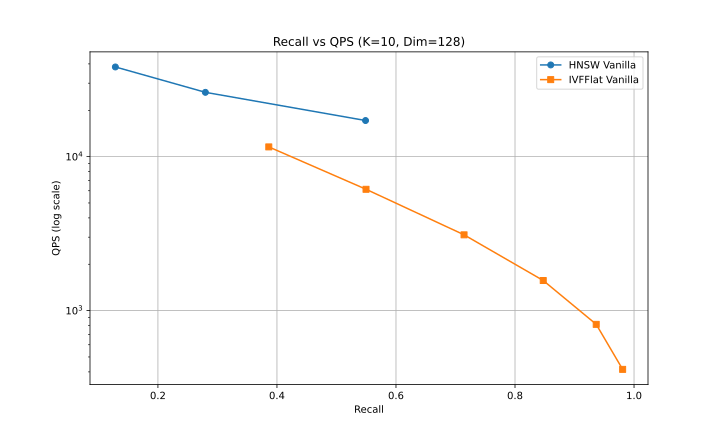
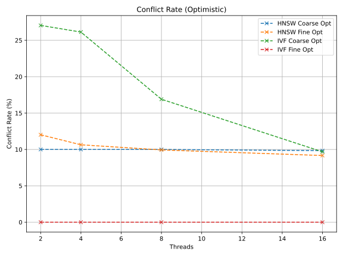

# Concurrent Vector Index Implementations for ANN Search.

## Requirements

*   **C++ Compiler**: GCC or Clang with C++17 support.
*   **Build System**: Meson and Ninja.
*   **Python**: Python 3.12+
*   **Package Manager**: `uv` (recommended) or `pip`.
*   **Libraries**: OpenMP (optional, for some baselines), HDF5 (for reading datasets).

## Installation

You can install `nilvec` directly from GitHub using pip. This is useful if you want to use the library in your own projects without cloning the repository for development.

```bash
# Basic install
pip install git+https://github.com/C0ll1nDr4k3/concurrency-benchmarks.git

# With FAISS CPU support
pip install "git+https://github.com/C0ll1nDr4k3/concurrency-benchmarks.git#egg=nilvec[cpu]"

# With FAISS GPU support
pip install "git+https://github.com/C0ll1nDr4k3/concurrency-benchmarks.git#egg=nilvec[gpu]"
```

## Setup (For Development)

1.  **Install Python Dependencies**:
    ```bash
    # For CPU
    uv sync --extra cpu

    # For GPU (Linux only)
    uv sync --extra gpu
    ```

2.  **Prepare Data**:
    The benchmark script automatically downloads the dataset (`data/sift-128-euclidean.hdf5`) if it is missing.


## Building

The project uses Meson for the C++ build and `uv` for the Python environment.

```bash
# Setup build directory
meson setup builddir -Duse_hdf5=true

# Compile C++ code and Python bindings
meson compile -C builddir
```

> [!WARNING]
> On Windows, If you encounter `LNK1104: cannot open file 'kernel32.lib'`, first try running the build commands from a "x64 Native Tools Command Prompt for VS 2022" or manually activate the environment:
> ```cmd
> call "C:\Program Files\Microsoft Visual Studio\2022\Community\VC\Auxiliary\Build\vcvarsall.bat" x64
> uv sync
> ```
>
> If the error persists, it usually means the Windows SDK is missing or corrupted. To fix this:
> 1. Open **Visual Studio Installer**.
> 2. Click **Modify** on your VS 2022 installation.
> 3. Under **Workloads**, ensure **Desktop development with C++** is checked.
> 4. In the **Installation details** sidebar on the right, ensure a **Windows 10 SDK** or **Windows 11 SDK** version (e.g., `10.0.xxxxx.x`) is checked.
> 5. Click **Modify** to install the missing components.


## Running Benchmarks

We use `main.py` as the unified entry point for running benchmarks and generating plots.

```bash
# Make sure the build directory is in your PYTHONPATH
export PYTHONPATH=$PYTHONPATH:$(pwd)/builddir

# Run full benchmarks (Throughput and Recall)
uv run main.py --dataset data/sift-128-euclidean.hdf5

# Run only throughput benchmarks (faster)
uv run main.py --dataset data/sift-128-euclidean.hdf5 --skip-recall

# Limit the dataset size for quick testing
uv run main.py --dataset data/sift-128-euclidean.hdf5 --skip-recall --limit 1000

# Persist results into DuckDB (cross-pollination is enabled by default)
uv run main.py --dataset data/sift-128-euclidean.hdf5 --results-db benchmark_results.duckdb

# Disable cross-pollination for an isolated run
uv run main.py --dataset data/sift-128-euclidean.hdf5 --results-db benchmark_results.duckdb --no-cross-pollinate

# Optional legacy pickle export
uv run main.py --dataset data/sift-128-euclidean.hdf5 --save-results benchmark_results.pkl
```

## Latest Benchmarks

Latest committed benchmark figures:

### Throughput Scaling

Throughput vs. Thread Count.

### Recall vs QPS

Recall vs. QPS.

### Conflict Rate

Conflict rate vs. thread count (optimistic variants).

## Testing

To run the Python binding tests:

```bash
export PYTHONPATH=$PYTHONPATH:$(pwd)/builddir
uv run test/test_bindings.py

## Code Formatting

```bash
clang-format -i **/*.cpp **/*.hpp && uv format
```

## Paper
typst watch paper/nilvec.typ --open
```
